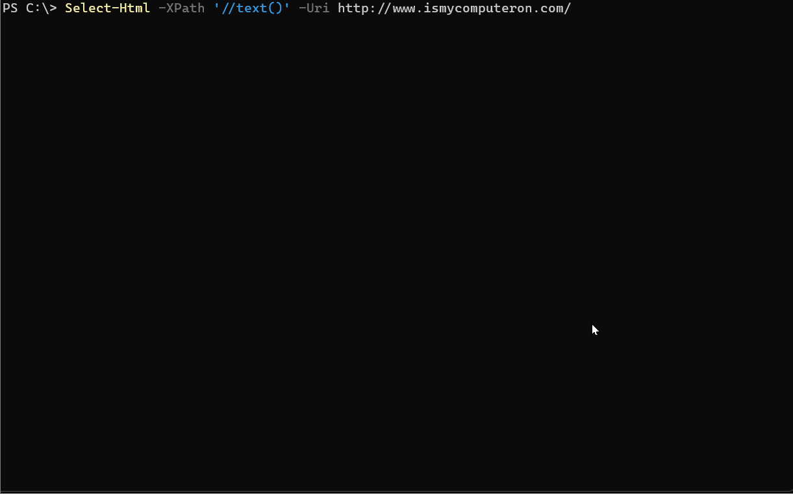

SelectHtml
================

<!-- Optional badges: -->

A PowerShell module for selecting data from HTML using the [HTML Agility Pack](https://html-agility-pack.net/).

To install: `Install-Module SelectHtml`

Cmdlets
-------

Documentation is automatically generated using [platyPS](https://github.com/PowerShell/platyPS) (`.\doc.cmd`).

- [Select-Html](https://github.com/brianary/SelectHtml/wiki/Select-Html) &mdash; Returns content from the HTML retrieved from a URL.

Tests
-----

Tests are written for [Pester](https://github.com/Pester/Pester) (`.\test.cmd`).
