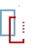

SelectHtml
================

<!-- To publish to PowerShell Gallery, commit an update to the .psd1 file -->

<!-- Optional badges: -->

A PowerShell module for selecting data from HTML

To install: `Install-Module SelectHtml`

<!-- Consider using LICEcap (cinst licecap) to capture a GIF animation of a small PowerShell window showing your module in use. -->

Cmdlets
-------

Documentation is automatically generated using [platyPS](https://github.com/PowerShell/platyPS) (`.\doc.cmd`).

- [Select-Html](docs/Select-Html.md) &mdash; Returns content from the HTML retrieved from a URL.

Tests
-----

Tests are written for [Pester](https://github.com/Pester/Pester) (`.\test.cmd`).
